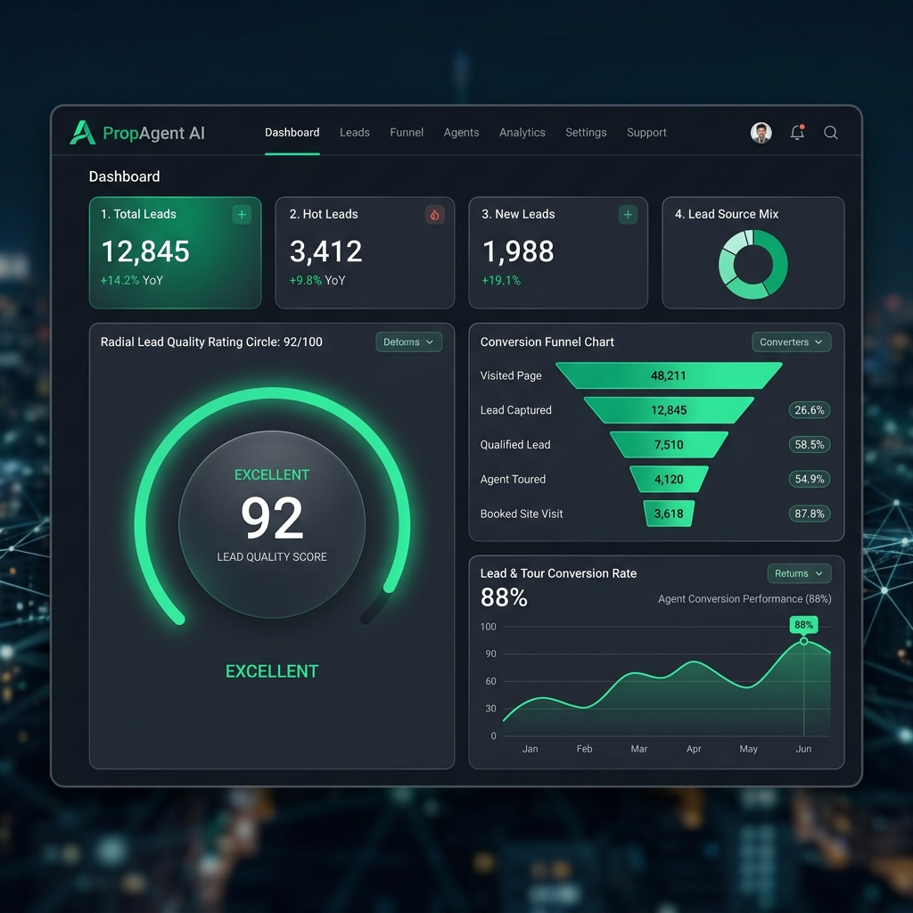
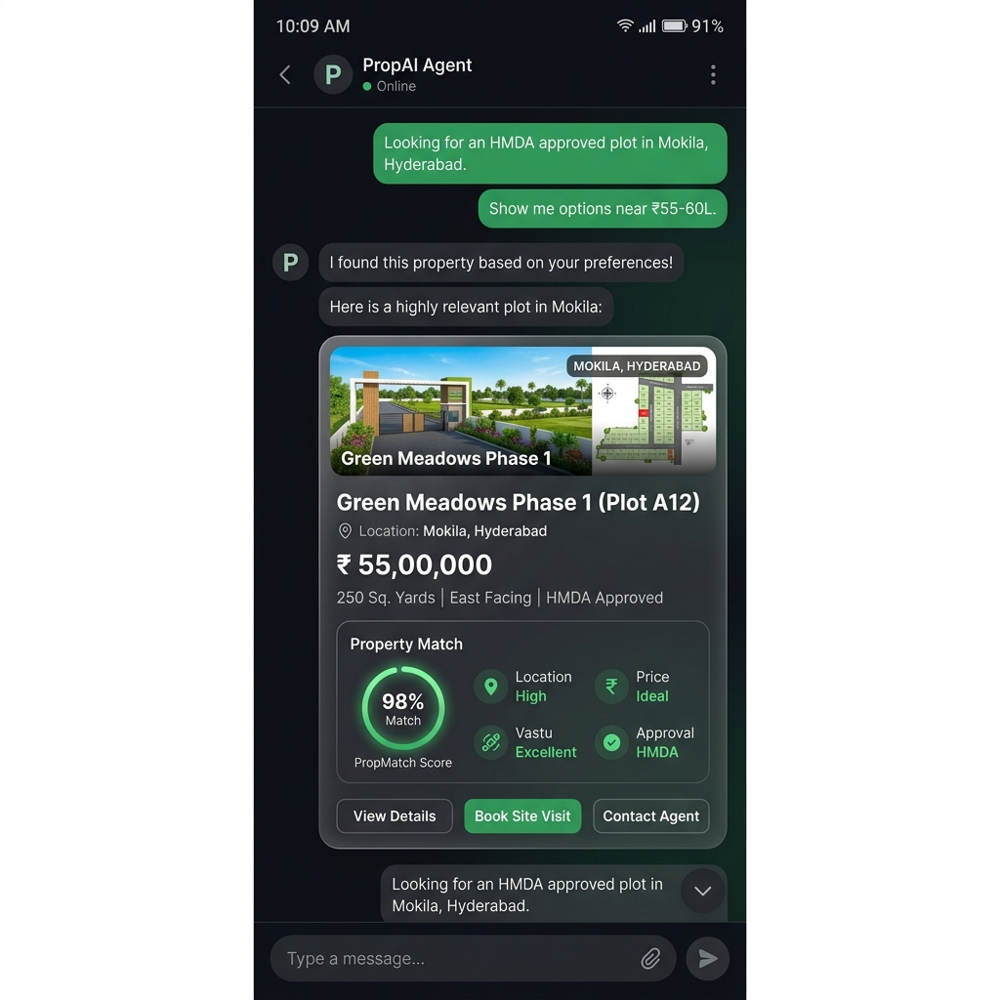
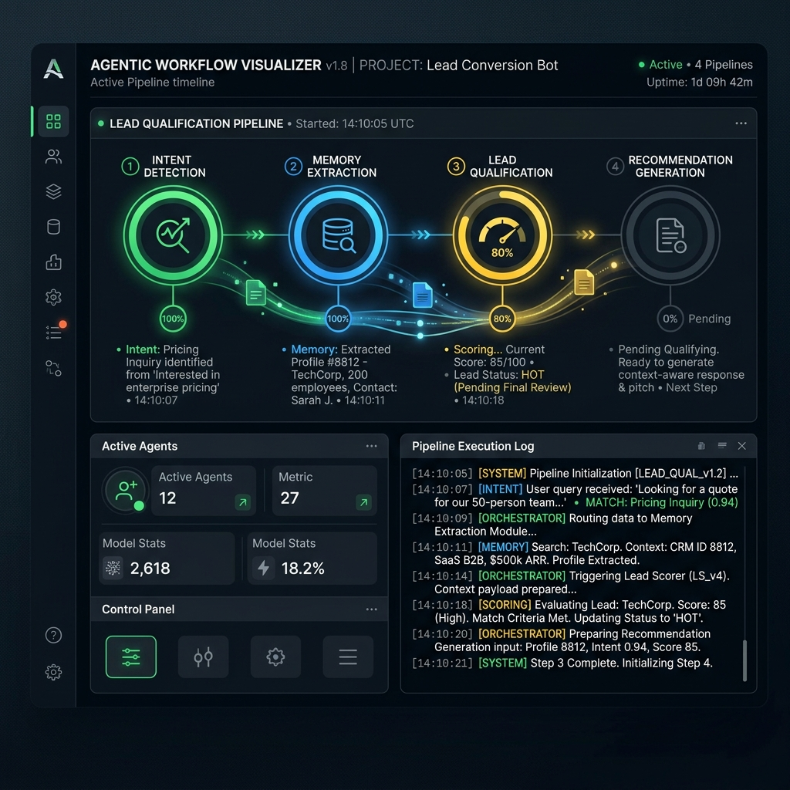
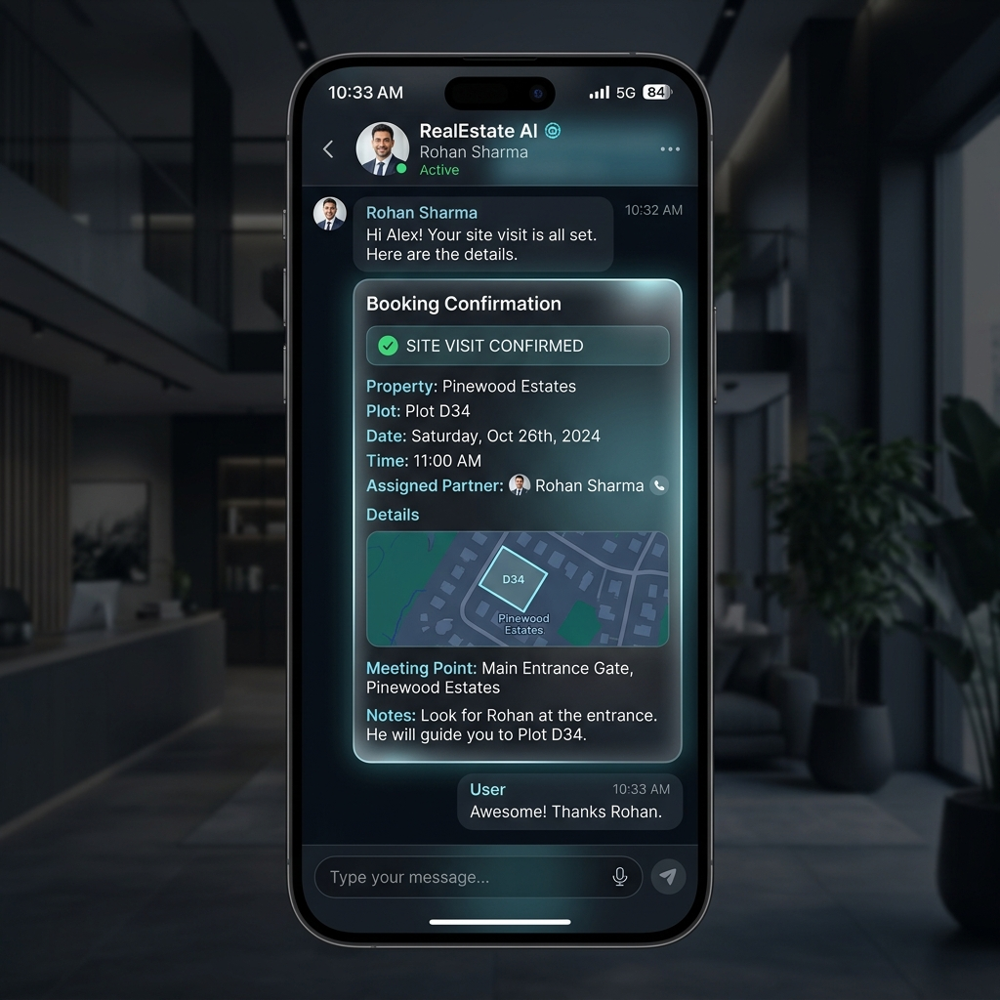
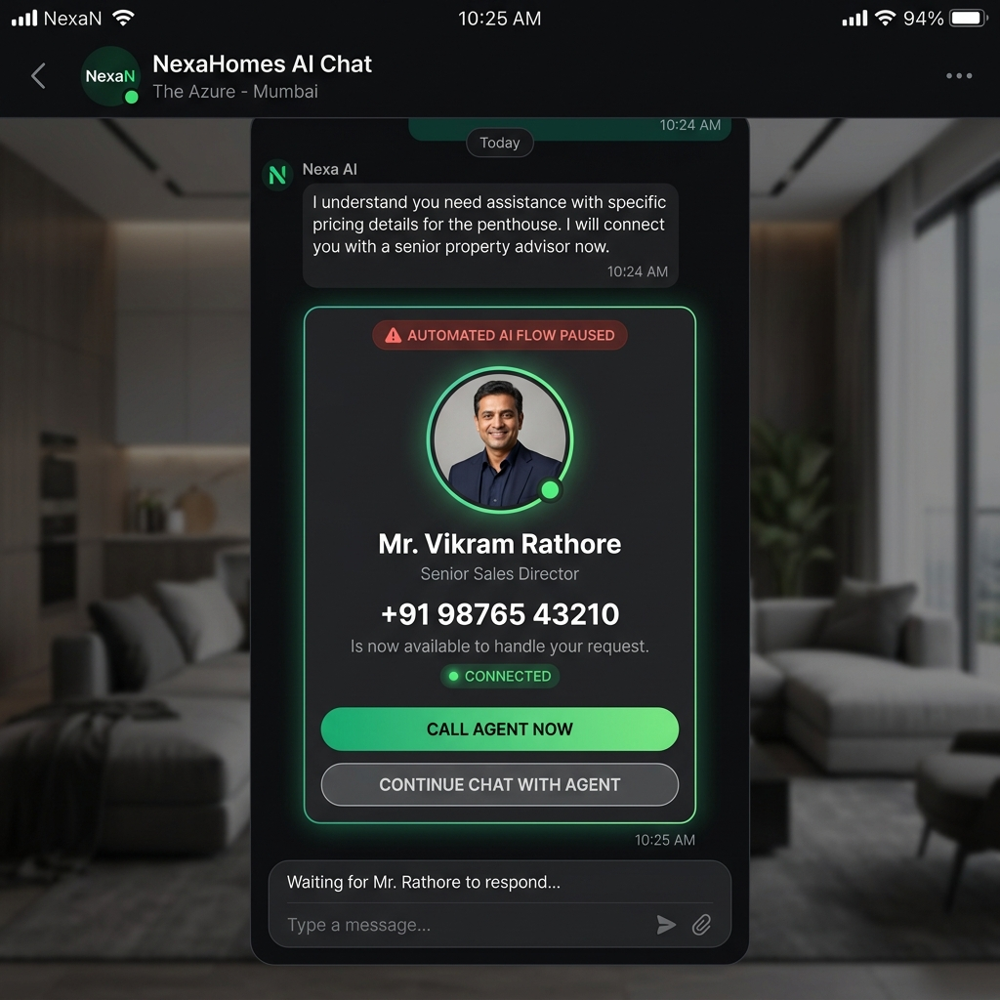
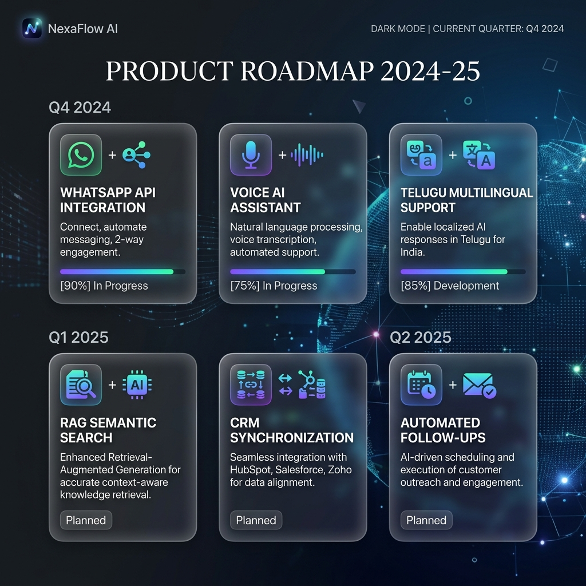

# PropAgent AI: Agentic AI-powered Real Estate Sales Automation Platform

PropAgent AI is a production-ready, portfolio-grade **GenAI + Agentic AI Sales Automation Platform** built for Real Estate and Plot Developers. The system uses a decoupled client-server architecture consisting of a **FastAPI (Python) Backend** and a **React (TypeScript + Vite) Frontend Dashboard** to qualify leads, score prospect buying probability, recommend properties, and schedule site tours.

---

## 1. Project Overview
PropAgent AI serves as an autonomous assistant for real estate sales teams, operating a stateful dialogue loop that qualifies buyers in real-time. Instead of simple FAQ trees, the platform leverages an autonomous state machine to guide prospects from intake to booking and seamlessly hand off hot prospects to human sales directors when price negotiations occur. The platform runs fully locally in an offline demo mode with zero dependencies, but supports optional live OpenAI GPT-4o-mini integrations.

---

## 2. Key Features
* **Stateful Dialogue Memory**: Automatically parses and extracts investor preferences (location, budget, timeline) from conversation.
* **Lead Qualification Scoring**: Computes lead temperature (`Hot`, `Warm`, `Cold`) and purchase probability (0-100%) dynamically.
* **AI Property Recommendations**: Recommends properties from a local SQLite knowledge base matching budget constraints and location filters.
* **Site Visit Booking**: Schedules tours, issues confirmed booking cards, and pushes notifications straight to the admin feed.
* **Escalation Hand-off**: Suspends agent automation and transfers control to Mr. Vikram Rathore (Senior Sales Director) when custom pricing negotiations are triggered.
* **Operations Dashboard**: Features real-time KPI metrics, conversion funnel visualization, and chronological audit feeds.

---

## 3. Agentic AI Workflow
PropAgent AI handles incoming messages through a structured, 6-stage reasoning pipeline:
1. **Intent Detection**: Evaluates messages against 11 target intents (greeting, documents_query, pricing_query, site_visit, emi_query, negotiation, escalation, etc.) with confidence metrics.
2. **Memory Extraction**: Extracts core search criteria (`budget`, `preferredLocations`, `investmentTimeline`) and updates the state.
3. **Lead Qualification**: Increments the lead score dynamically based on details gathered and milestones completed.
4. **Recommendation Generation**: Queries the compliance database to match available inventory and explain suitability.
5. **Workflow Transition**: Updates the active pipeline stage (`initial`, `qualifying`, `recommending`, `booking`, `escalation`, `completed`).
6. **Next Best Action**: Dispatches conversational target goals (e.g. asking for missing data, prompting site tours).

---

## 4. Architecture Diagram
The flowchart below illustrates the client-server orchestration and decoupled analytics sync:

```mermaid
flowchart TD
    %% Styling Definitions
    classDef client fill:#0f172a,stroke:#10b981,stroke-width:2px,color:#f8fafc;
    classDef server fill:#1e1b4b,stroke:#a855f7,stroke-width:2px,color:#f8fafc;
    classDef db fill:#022c22,stroke:#0d9488,stroke-width:2px,color:#f8fafc;

    %% Nodes
    User([👤 User / Lead]) :::client
    Frontend[💻 React Frontend Dashboard] :::client
    Backend[⚡ FastAPI Backend Server] :::server
    Engine[🧠 Agentic AI Workflow Engine] :::server
    Memory[💾 Stateful Memory & Lead Scoring] :::server
    RecEngine[🎯 Recommendation Intelligence] :::server
    Analytics[📊 Analytics Service] :::server
    Database[(🗄️ In-Memory SQLite / Dict Store)] :::db

    %% Relationships
    User <--> |Interacts / WhatsApp Simulation| Frontend
    Frontend <--> |Secure REST API POST /api/chat| Backend
    Backend <--> |Message Content / Context| Engine
    Engine <--> |Memory Extraction / Score Recalculation| Memory
    Engine <--> |Preference Vector matching| RecEngine
    RecEngine <--> |Knowledge Retrieval| Database
    Engine --> |Audit logs / Milestones| Analytics
    Analytics --> |Sync metrics GET /api/dashboard| Frontend
```

---

## 5. Dashboard Screenshots
Browse the visual portfolio mockups illustrating the running application states:
* **Admin Analytics & Funnel Overview**: 
* **Intelligent Plot Recommendations Card**: 
* **6-Stage Agentic Reasoning Timeline**: 
* **Confirmed Site Visit Booking Card**: 
* **Human Escalation Hand-off Alert**: 
* **Future Scope Roadmap Panel**: 

---

## 6. Demo Scenarios
Select active customer profiles in the left sidebar to test key capabilities:
1. **Rahul Sharma (Qualification Flow)**: Typing *55 Lakhs* updates budget memory, triggers Lead Score recalculations, and outputs a recommended plot.
2. **Priya Reddy (ROI discussion)**: Ask *What is the appreciation potential?* to view y-o-y capital growth metrics.
3. **Sneha Reddy (Site Tour Booking)**: Type *Book a site visit for Saturday* to schedule a tour, receive a booking card, and watch dashboard metrics increment.
4. **Arjun Mehta (Escalation Handoff)**: Type *I want to negotiate the price* to trigger escalation routing, pausing AI responses and displaying Vikram Rathore's card.

---

## 7. Tech Stack
* **Core & Languages**: React (TypeScript), Python 3.10+
* **Backend Framework**: FastAPI, Uvicorn, Pydantic, HTTPX
* **Frontend Framework**: Vite, Tailwind CSS, Framer Motion, Lucide icons
* **Packaging & Scripts**: npm, pip

---

## 8. API Architecture
The backend registers decoupled endpoints to feed the admin dashboard and process chats:

### `POST /api/chat`
Ingests message inputs, runs the dialogue engine, and returns a structured AI response packet:
```json
{
  "message": "Based on your requirements, the best-matched property is...",
  "intent": "pricing_query",
  "confidence": 0.96,
  "lead_score": 75,
  "temperature": "Warm",
  "conversation_stage": "recommending",
  "next_action": "suggest_site_visit",
  "cards": [
    {
      "type": "property",
      "data": { "id": "prop-1", "name": "Green Meadows A12", "price": "₹55,00,000", "matchScore": 95 }
    }
  ],
  "memory_updates": { "budget": "₹55L" },
  "workflow_steps": ["Intent parsed: pricing_query", "Memory update: budget=₹55L"]
}
```

* `GET /api/dashboard`: Returns aggregate analytics (KPI metrics, lead temperature counters, Conversion Funnel widths, and chronological audit feeds).
* `GET /api/leads`: Lists active customer profiles.
* `GET /api/properties`: Lists properties from the knowledge base.
* `POST /api/reset-demo`: Restores database sessions to seeded default states.

---

## 9. Deployment Instructions

### Local Environment Setup
1. **FastAPI Backend**:
   ```bash
   cd backend
   pip install -r requirements.txt
   python main.py
   ```
2. **Vite Frontend**:
   ```bash
   cd frontend
   npm install
   npm run dev
   ```
3. Open `http://localhost:3000` in your browser.

### Backend Deployment (Render)
1. Register a new **Web Service** on Render and connect your repository.
2. Select **Python** as runtime.
3. Configure the **Build Command**:
   ```bash
   pip install -r backend/requirements.txt
   ```
4. Configure the **Start Command**:
   ```bash
   cd backend && uvicorn main:app --host 0.0.0.0 --port $PORT
   ```
5. Set Environment Variables:
   - `DEMO_MODE` = `true` (forces offline simulation)
   - `CORS_ORIGIN` = `https://your-frontend.vercel.app` (restricts CORS access to your frontend)

### Frontend Deployment (Vercel)
1. Add a new project on Vercel and connect your repository.
2. Set the **Framework Preset** to `Vite`, **Build Command** to `npm run build`, and **Output Directory** to `dist`.
3. Set the Root Directory to `frontend`.
4. Configure Environment Variables:
   - `VITE_API_URL` = `https://your-backend.onrender.com` (your deployed Render API URL)
5. Vercel utilizes the included `vercel.json` SPA config to rewrite route entries to `index.html` during page refresh.

---

## 10. Future Scope
* **Official WhatsApp Business APIs**: Upgrading Sandbox webhooks to verified commercial profiles.
* **Voice Integration**: Utilizing Whisper API transcribing to parse incoming voice notes.
* **Regional Language Localizations**: Translating dialog routes natively in Telugu for regional investors.
* **Vector Semantic Search**: Indexing DTCP zoning deeds in Pgvector / ChromaDB for document QA.
* **Builder CRM Synchronizations**: Pushing hot leads directly to Salesforce or HubSpot.
* **Nurturing Follow-up Dripping**: Automating timeline-based drips depending on timeline goals.

---

## 11. Experimental WhatsApp Integration
All Twilio Sandbox integration logic is kept fully isolated inside the `backend/integrations/experimental/` folder to prevent startup crashes or key dependency warnings:
* **[whatsapp_webhook.py](file:///C:/Users/Tilak/.gemini/antigravity/scratch/whatsapp-realestate-assistant/backend/integrations/experimental/whatsapp_webhook.py)**: APIRouter webhook controller parsing url-encoded Twilio requests (`POST /webhook/whatsapp`) and replying with TwiML XML.
* **[whatsapp_formatter.py](file:///C:/Users/Tilak/.gemini/antigravity/scratch/whatsapp-realestate-assistant/backend/integrations/experimental/whatsapp_formatter.py)**: Compiles structured cards (property info, EMIs, bookings) into rich bold WhatsApp text layouts.

---

## 12. Why Agentic AI?
Traditional bots operate on brittle, state-blind decision maps. If a buyer mentions their budget out of sequence, the bot resets or outputs fallbacks. PropAgent AI uses stateful memory persistence to track customer search criteria, computing next-best-action priorities at each turn. The orchestration engine separates conversation stages dynamically and manages agent-to-human handoff seamlessly when complex negotiations arise.

---

## 13. Portfolio Highlights
* **Recruiter-Ready Code**: Written using clean React components, Vite configuration, and FastAPI APIRouters.
* **Visual Excellence**: Dark-mode glassmorphic styling, pulse animation loops, and Framer Motion transitions.
* **100% Offline Robustness**: The application boots instantly without external API keys, falling back cleanly to client-side mocks if the local server is stopped.
